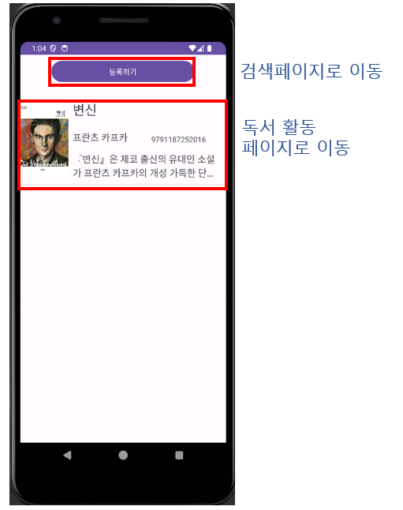
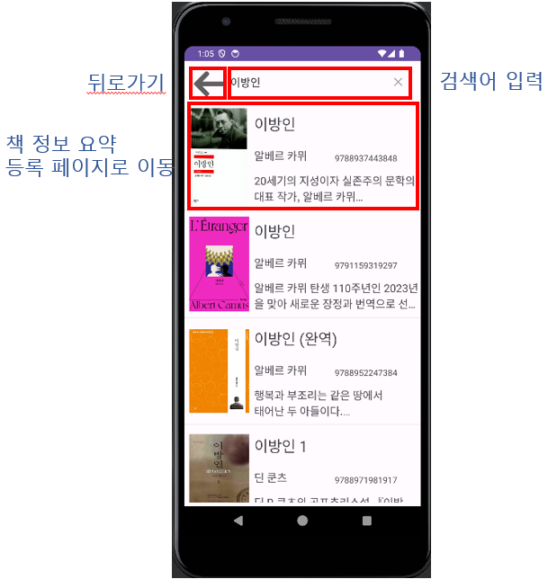
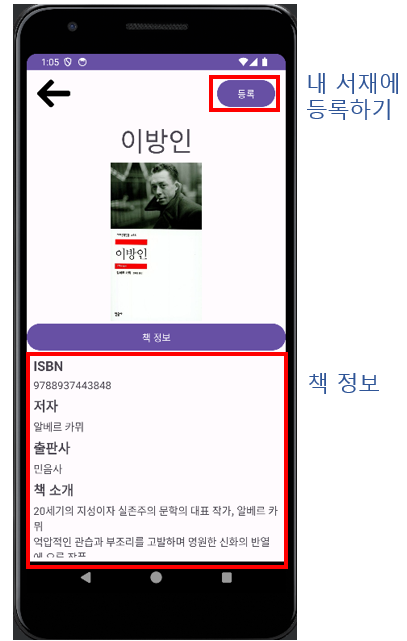
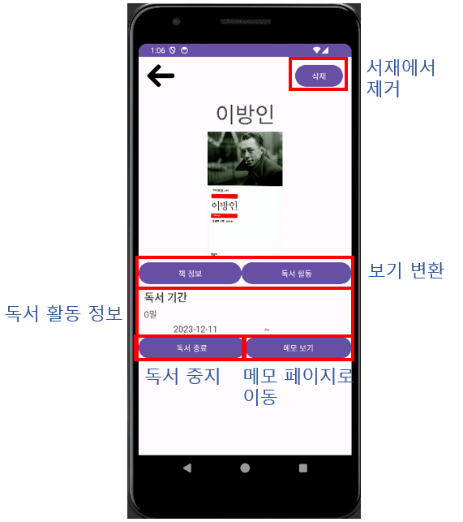
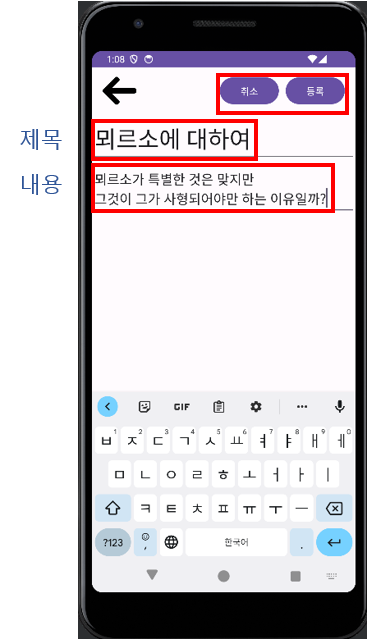

# Bookmark

Bookmark는 도서를 검색하고 내 서재에 등록한 뒤, 책별 독서 상태와 메모를 관리하는 Android 앱입니다.

## 화면

| 내 서재 | 도서 검색 |
| --- | --- |
| 등록한 도서를 목록으로 확인하고, 상단 버튼으로 도서 검색 화면으로 이동할 수 있습니다. | 검색어를 입력하면 Naver Book Search API를 통해 도서 목록을 조회합니다. 목록에서 책을 선택하면 상세 정보와 등록 화면으로 이동합니다. |
|  |  |
| 서재에 등록 | 독서 활동 관리 |
| 검색한 도서의 ISBN, 저자, 출판사, 책 소개를 확인하고 내 서재에 등록합니다. | 내 서재에 등록한 책은 독서 기간을 확인하고, 독서 종료 또는 재개 상태로 변경할 수 있습니다. 책 삭제와 메모 페이지 이동도 이 화면에서 처리합니다. |
|  |  |
| 메모 작성 |  |
| 책별로 제목과 내용을 입력해 메모를 작성합니다. |  |
|  |  |

## 주요 기능

- Naver Book Search API를 이용한 도서 검색
- 검색한 도서의 상세 정보 확인
- 도서를 내 서재에 등록
- 등록한 도서 목록 조회 및 삭제
- 독서 시작일, 종료일, 독서 기간 관리
- 책별 메모 작성, 조회, 수정, 삭제
- SQLite를 이용한 로컬 데이터 저장

## 기술 스택

<p>
  
  
</p>

<p>
  
  
</p>

<p>
  
  
  
  
</p>

<p>
  
  
</p>

## 프로젝트 구조

```text
bookmark/
├── app/
│   ├── build.gradle.kts
│   └── src/main/
│       ├── AndroidManifest.xml
│       ├── java/com/example/bookmanager/
│       └── res/
├── build.gradle.kts
├── settings.gradle.kts
└── gradlew.bat
```

## 개발 환경

- Android Studio
- JDK 17 권장
- Android SDK
- compileSdk: 34
- minSdk: 26
- targetSdk: 33

## 실행 방법

1. Android Studio에서 `bookmark` 폴더를 엽니다.
2. Gradle 동기화가 완료될 때까지 기다립니다.
3. 에뮬레이터 또는 Android 기기를 연결합니다.
4. `app` 실행 구성을 선택하고 실행합니다.

터미널에서 빌드하려면 프로젝트 루트에서 아래 명령을 실행합니다.

```powershell
.\gradlew.bat assembleDebug
```

테스트를 실행하려면 아래 명령을 사용합니다.

```powershell
.\gradlew.bat test
```

## 데이터 저장

앱은 `BookManager.db` SQLite 데이터베이스를 사용합니다.

- `Book`: 등록한 도서 정보와 독서 기간 저장
- `Memo`: 책별 메모 저장

`Memo` 테이블은 `Book` 테이블의 `isbn`을 참조하며, 도서가 삭제되면 관련 메모도 함께 삭제됩니다.

## API 사용

도서 검색은 Naver Book Search API를 사용합니다.

현재 API 인증 정보는 `SearchActivity.kt`에 직접 정의되어 있습니다. 배포용 앱에서는 인증 정보를 코드에 직접 포함하지 말고 안전한 설정 방식으로 분리하는 것이 좋습니다.

## 라이선스

이 프로젝트는 [LICENSE](LICENSE)를 따릅니다.
